# Making Deep Learning Go Brrrr From First Principles
So, you want to improve the performance of your deep learning model. How might you approach such a task? Often, folk fall back to a grab-bag of tricks that might've worked before or saw on a tweet. "Use in-place operations! Set gradients to None! Install PyTorch 1.10.0 but not 1.10.1!"

It's understandable why users often take such an ad-hoc approach performance on modern systems (particularly deep learning) often feels as much like alchemy as it do
es science. That being said, reasoning from first principles can still eliminate broad swathes of approaches, thus making the problem much more approachable.

For example, getting good performance on a dataset with deep learning also involves a lot of guesswork. But, if your training loss is way lower than your test loss, you're in the "overfitting" regime, and you're wasting your time if you try to increase the capacity of your model. Or, if your training loss is identical to your validation loss, you're wasting your time if you try to regularize your model.

Similarly, you can understand efficient of your deep learning regime as consisting of 3 different components. 
1. Compute: Time spent on your GPU computing actual floating point operations (FLOPS)
2. Memory: Time spent transferring tensors within a GPU
3. Overhead: Everything else

Just like with training ML models, knowing what regime you're in allows you to narrow in on optimizations that matters. For example, if you're spending all of your time doing memory transfers (i.e. you are in an *memory-bandwidth bound* regime), then increasing the FLOPS of your GPU won't help. On the other hand, if you're spending all of your time performing big chonky matmuls (i.e. a *compute-bound* regime), then rewriting your model logic into C++ to reduce overhead won't help.

So, if you want to keep your GPUs going brrrr, let's discuss the three components your system might be spending time on - compute, memory bandwidth, and overhead.

<figure>
<center>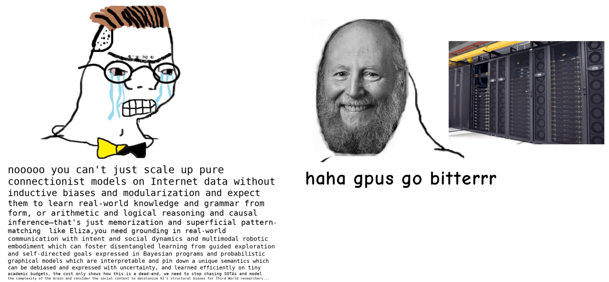</center>
<figcaption align = "center"><i>Behind the bitter lesson is a legion of engineers keeping GPUs running efficiently. Image from [gwern](https://www.gwern.net/newsletter/2020/05)</i></figcaption>

</figure>

Note: Most of this post will use GPUs and PyTorch as examples (as I work on the PyTorch team), but the principles almost all generalize across hardware and frameworks.

## Compute
One perspective on optimizing deep learning systems is that we'd like to maximize the time in the compute-bound regime. You paid for all of those 312 teraflops, and ideally, you'd *get* those 312 teraflops. But, in order to get your money's worth out of your expensive matrix multiplication, you need to reduce the amount of time spent in the other parts.

But why the focus on maximizing compute and not say, memory bandwidth? The reason is simple - you can reduce the overhead or memory costs, but you (mostly) can't reduce the computation required without changing the actual operations you're performing. 

Exacerbating the difficulty of maximizing compute utilization is the rate at which compute grows compared to memory bandwidth. Take [this table](https://cacm.acm.org/magazines/2004/10/6401-latency-lags-bandwith/fulltext) on CPU FLOPS doubling times vs. memory bandwidth doubling times

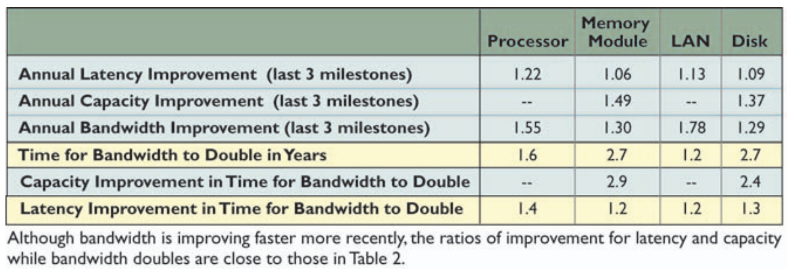

One way to think about compute is as a factory. We send instructions to our factory (overhead), send it materials (memory-bandwidth), all to keep our factory running efficiently (compute).

<center>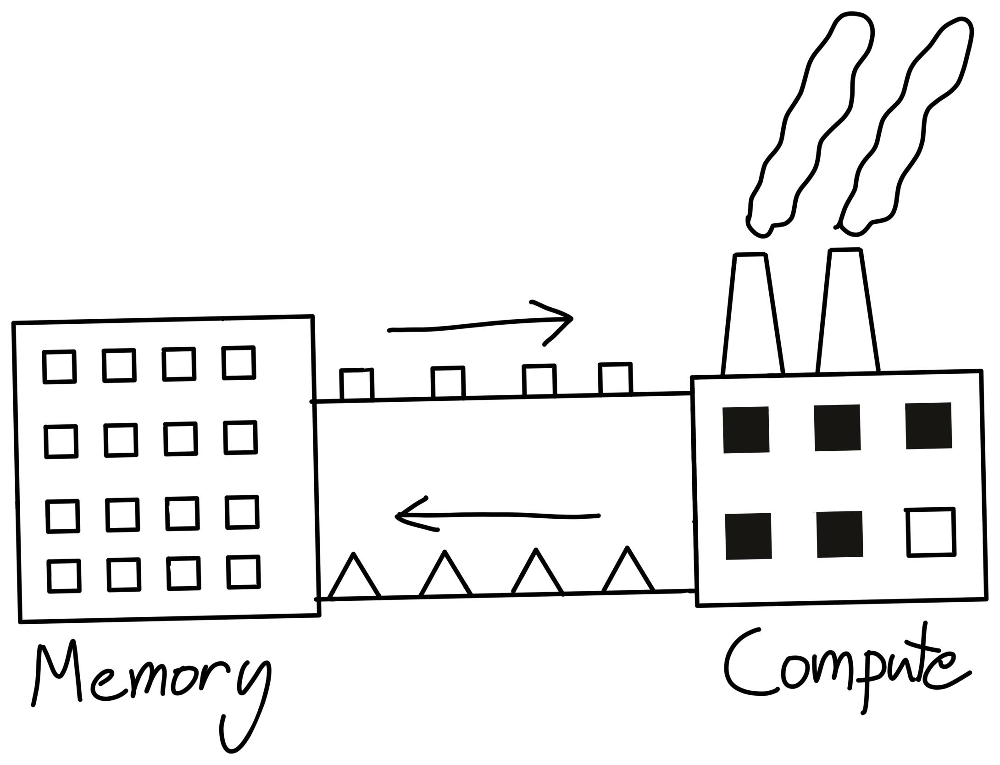</center>

So, if our factory increases efficiency faster than the rate at which we can supply it materials, it becomes harder for our factory to achieve its peak efficiency.

<figure>
<center>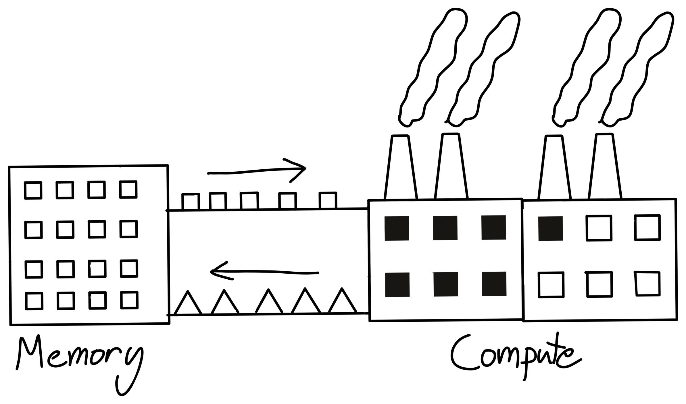</center>
<figcaption align = "center"><i>Even though our factory's size (FLOPS) doubled - if our bandwidth can't keep up then our performance isn't also going to double</i></figcaption>
</figure>

Along with implying permanent job security for ML systems engineers, this growing difficulty in utilizing our compute also makes understanding our bottlenecks even more important.


One more addendum about FLOPS. Modern machine learning accelerators all have hardware specialized for matrix-multiplication, such as Nvidia's "Tensor Cores". 
<center>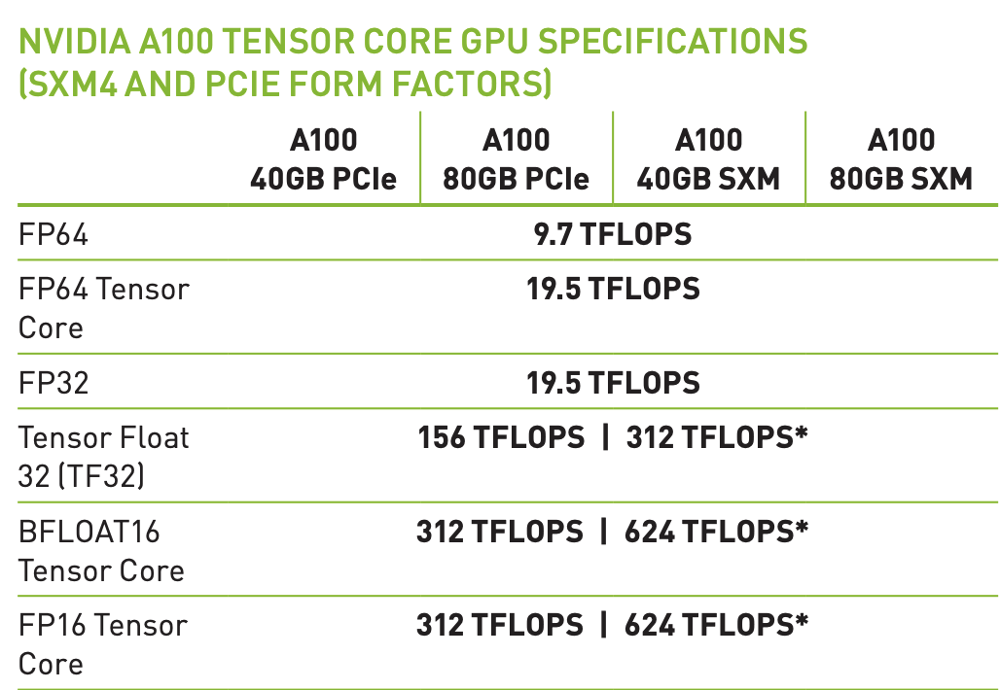</center>

So, if you aren't doing matrix multiplication, you'll only be able to achieve 19.5 teraflops instead of the stated 312. Note that this isn't unique to GPUs - in fact, TPUs are even *less* general than GPUs.


The fact that GPUs are so much slower at everything that isn't a matrix multiply might seem problematic at first - what about our other operators like layer norm or activation functions? Well, the truth is, those operators are just rounding errors in terms of FLOPS. For example, let's look at this table of FLOP counts on BERT for different operator types from [this paper](https://arxiv.org/abs/2007.00072), where "Tensor Contraction" = matmuls.

<center>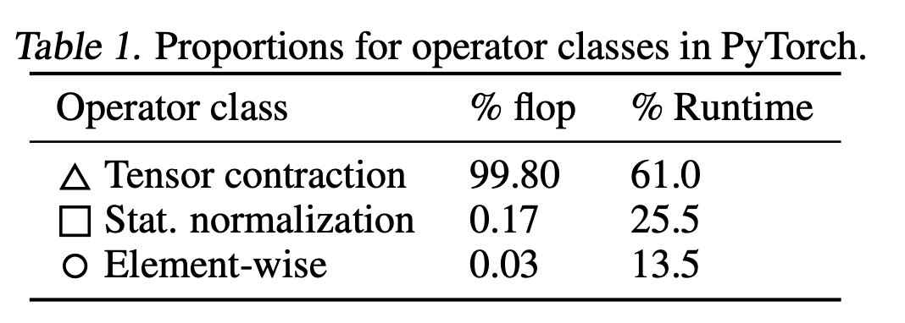</center>

You can see that altogether, our non-matmul ops only make up 0.2% of our FLOPS, so it doesn't matter that our GPU computes non-matmul ops 15x slower.

But, in this case, the normalization and pointwise ops actually achieve **250x less FLOPS and 700x less FLOPS** than our matmuls respectively.

So why do our non-matmul ops take so much more time than they should?

Going back to our analogy, the culprit is often how long it takes to transport materials to and from the factory. In other words, the memory bandwidth.


## Bandwidth
Bandwidth costs are essentially the cost paid to move data from one place to another. This might be moving the data from CPU to GPU, from one node to another, or even from CUDA global memory to CUDA shared memory. This last one, in particular, is what we'll be focusing on here, and is typically referred to as "bandwidth cost" or "memory bandwidth cost".

The other two (typically referred to as "data transfer costs" and "network costs" respectively) are certainly important, but going into distributed performance would cause me to never finish this post.

To understand what the memory bandwidth cost is, let's head back to our factory analogy.

Although our factory is where we do the actual work, it's not suitable as a bulk storage unit. A large part of this is that since we're doing actual work here, all the storage is optimized for being fast to actually *use* (SRAM), instead of having a lot of it.

So, where do we store the actual results and materials? The typical approach is to have a warehouse, probably somewhere where land is cheap and we have a lot of space (DRAM). Then, we can ship supplies to and from our factories (memory bandwidth).

<center>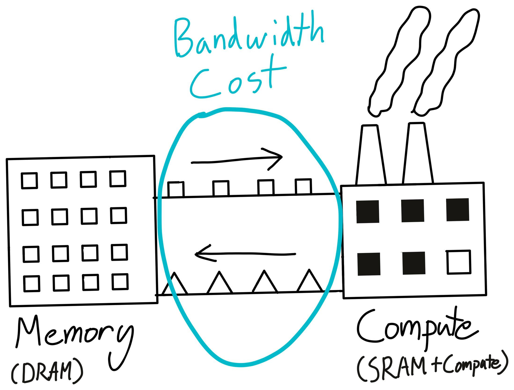</center>

This cost of moving stuff to and from our compute units is what's called the "memory bandwidth" cost.  As an aside, your GPU's DRAM is what shows up in `nvidia-smi`, and is the primary quantity responsible for your lovely "CUDA Out of Memory' errors.

One thing to note is that every single time we perform a GPU kernel, we need to move our data from and back to our GPU's DRAM (i.e. our warehouse).

Now, imagine what happens when we perform an unary operation like `torch.cos`. We need to ship our data from our storage to the warehouse, then perform a tiny bit of computation for each piece of data, and then ship that storage back. Shipping things around is quite expensive. As a result, nearly all of our time here is spent shipping data around, and *not* on the actual computation itself.

Since we're spending all of our time on memory-bandwidth, such an operation is called a **memory-bound operation**, and it means that we're not spending a lot of time on compute.

Ok, so that's not ideal. What can we do about it? Let's take a look at how a sequence of operators might look.

<figure>
<center>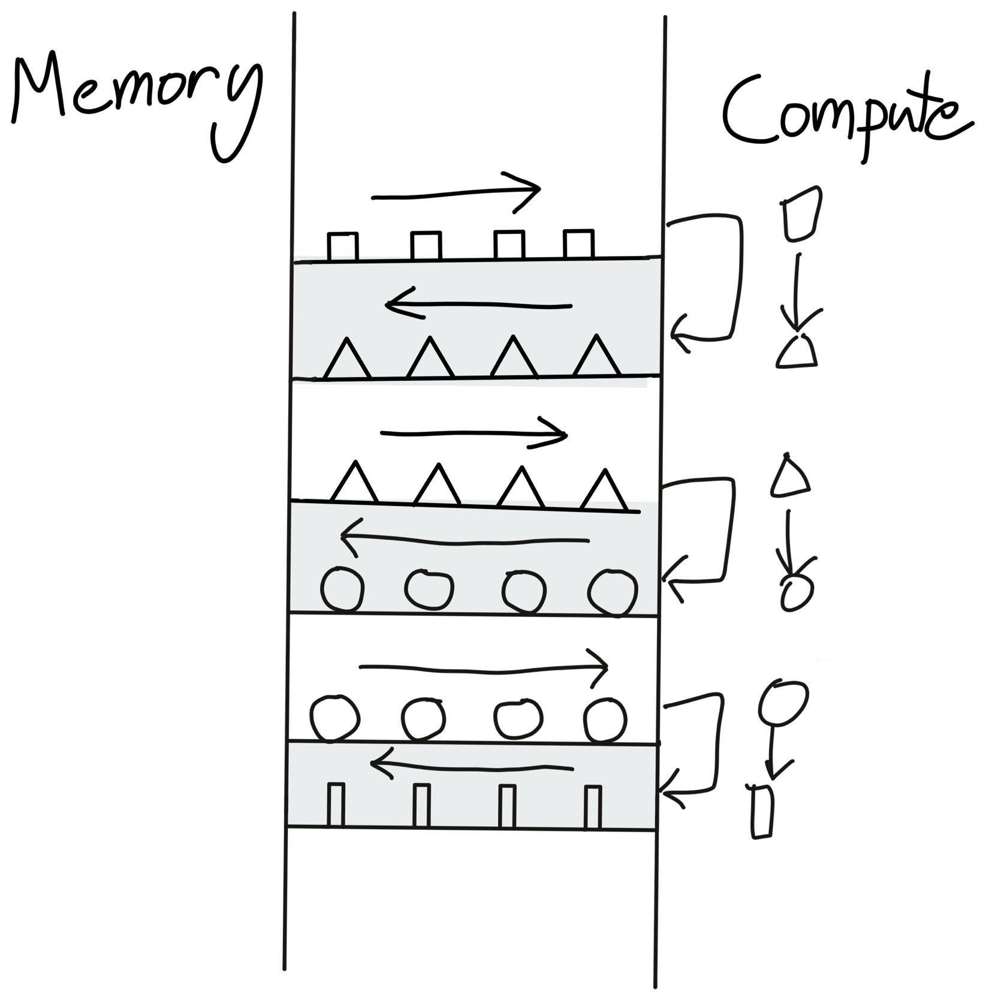</center>
<figcaption align = "center"><i>Here's how a sequence of pointwise operators might look like.</i></figcaption>
</figure>

Hey! This is a very stupid arrangement. Why are we sending the same data to global memory and then back to the compute units, over and over? We should just keep the data at the factory, perform all of our compute, and then send it back!

<figure>
<center>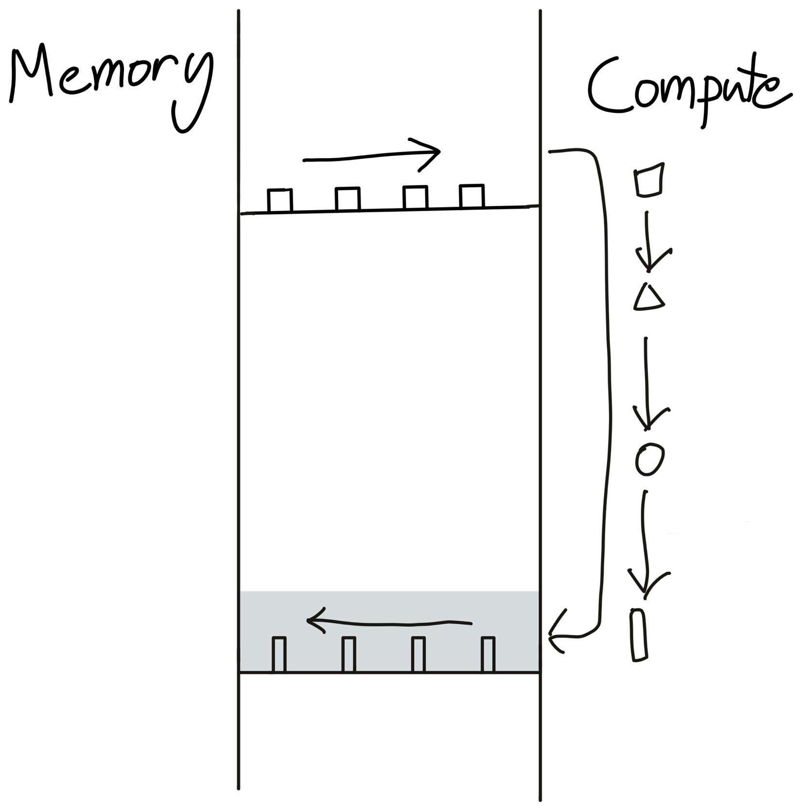</center>
<figcaption align = "center"><i>Instead of sending our triangle back to global memory just to read it back again, we instead just do all of our operations in one go.</i></figcaption>
</figure>

This is operator fusion - the most important optimization in deep learning compilers. Simply put, instead of writing our data to global memory just to read it again, we elide the extra memory accesses by performing several computations at once.

For example, if we perform `x.cos().cos()`, usually we need to perform 4 global reads and writes.

```python
x1 = x.cos() # Read from x in global memory, write to x1
x2 = x1.cos() # Read from x1 in global memory, write to x2
```

But, with operator fusion, we only need 2 global memory reads and writes! So operator fusion will speed it up by 2x.

```python
x2 = x.cos().cos() # Read from x in global memory, write to x2
```

Much better.

There are a couple of caveats that make this a bit tricky. First of all, the GPU needs to know what's going to happen next when performing the current operation. So, you can't do this optimization in eager-mode, where PyTorch runs operators one at a time. Second, we actually need to generate CUDA code for this, which opens up a whole new can of worms.

Not all operator fusion is as simple as pointwise operators. You can fuse pointwise operators onto reductions, or pointwise operators onto matrix multiplication. Even matrix multiplication itself can be thought of as fusing a broadcasting multiply followed by a reduction.

If you're interested in writing custom CUDA kernels, it's likely that this is where you'll see the most benefit. Any 2 PyTorch operators present an opportunity for fusion, thus saving the memory bandwidth costs of reading/writing out to global memory between them. In addition, many existing compilers can often perform "simple" fusions - NVFuser and XLA being two examples. However, automated systems are no match for human ingenuity, so if you want to try out writing some custom CUDA kernels yourself, [Triton](https://openai.com/blog/triton/) is a great place to start.

Finally, operator fusion leads to some surprising consequences. For one, a fused `x.cos().cos()` will take nearly the exact same time as calling `x.cos()` by itself. This is why activation functions are nearly all the same cost, despite `gelu` obviously consisting of many more operations than `relu`. 

This fact leads to some interesting consequences for rematerialization/activation checkpointing. Essentially, doing extra recomputation might lead to *less* memory-bandwidth, and thus less runtime. Thus, we can lower both memory *and* runtime through rematerialization, which we leveraged to build a neat min-cut optimization pass in AOTAutograd. You can read more about it [here](https://dev-discuss.pytorch.org/t/min-cut-optimal-recomputation-i-e-activation-checkpointing-with-aotautograd/467/1) (might also go into it in a future blog post!)


#### Reasoning about Memory-Bandwidth Costs
When it come to reasoning about whether your operation is memory-bandwidth bound, a calculator can go a long way.

For simple operators, it's feasible to reason about your memory bandwidth directly. For example, an A100 has 1.5 terabytes/second of global memory bandwidth, and can perform 19.5 teraflops/second of compute. So, if you're using 32 bit floats (i.e. 8 bytes), you can load in 200 billion numbers in the same time that the GPU can perform 20 trillion operations. Moreover, to perform a simple unary operator (like multiplying a tensor by 2), we actually need to *write* the tensor back to global memory.

So... until you're doing about a hundred operations in your unary operator, you'll be spending more time performing memory accesses than actual compute.

With the help of a fusing compiler like NVFuser, it's actually fairly easy to measure this ourselves! You can see the code in Colab [here](https://colab.research.google.com/drive/1hEtorT5y9mcXHR0gpensD7oZfuyyxtu7?usp=sharing).

If you take a PyTorch function like 
```python
def f(x: Tensor[N]):
    for _ in range(repeat):
        x = x * 2
    return x
```
and benchmark it with a fusing compiler, we can then calculate the FLOPS and memory bandwidth achieved for various values of `repeat`. Increasing `repeat` is an easy way of increasing our amount of compute *without* increasing our memory accesses - this is also known as increasing **compute intensity**.

Specifically, let's say we benchmark this code, and find the number of iterations we perform per second. Then, as a function of N (the size of our tensor), we'll perform `2*N` memory accesses, and `N * repeat` FLOP. So, the memory bandwidth achieved would be `bytes_per_elem * 2 * N / itrs_per_second `, and FLOPS achieved would be `N * repeat / itrs_per_second`.

Now, let's plot the runtime, flops, and memory bandwidth achieved as a function of the compute intensity. Note that everything is on a log-log scale.
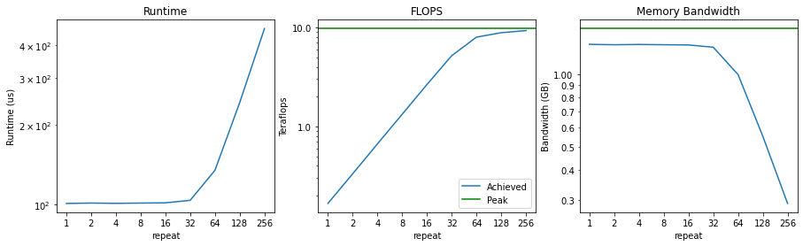

First, notice that the runtime doesn't increase noticeably *at all* until we're performing 64 multiplications. That means that up until that point, we're mostly memory-bandwidth bound - our compute is mostly sitting idle.

As a result, we start off by achieving a measly 0.2 teraflops. As we double the compute intensity, this number grows linearly, until we get close to our peak of 9.75 teraflops [^fma]. Once we're close to our peak teraflops, we are considered to be "compute bound".

Finally, you can see that our memory bandwidth achieved starts out near the peak, and as we increase our compute intensity it starts to drop. This is exactly what we should expect, as we're spending more and more time performing actual compute instead of accessing memory.

In this case, it's easy to see when we're compute-bound and when we're memory-bound. For `repeat < 32`, we're saturating our memory-bandwidth while our compute is underutilized. Conversely, once `repeat > 64`, we see that we're saturating our compute (i.e. achieving close to peak FLOPS), while our utilized memory bandwidth starts to drop.

For larger systems, it's often more difficult to say whether you're compute bound or memory-bandwidth bound, often since they contain a mix of compute-bound and memory-bound components.

One common approach to measuring how compute-bound you are is to measure your achieved FLOPS as a percentage of peak FLOPS. For example, if you're achieving 80% of your peak FLOPS, then you know that you're at least 80% compute bound, which is pretty good! The rest of your time is probably spent doing memory-bandwidth operations. [^flop_count]

However, in addition to memory-bandwidth costs, there's one more thing that might cause your GPUs to not go brrrrr.

## Overhead
Overhead is when your code is spending time doing anything that's **not** transferring tensors or computing things. For example, time spent in the Python interpreter? Overhead. Time spent in the PyTorch framework? Overhead. Time spent launching CUDA kernels (but not executing them)? Also... overhead.

The primary reason overhead is such a pernicious problem is that modern GPUs are *really* fast. An A100 can perform 312 **trillion** floating point operations per second (312 TeraFLOPS). In comparison, Python is *really* slooooowwww. Benchmarking locally, Python can perform 32 million additions in one second.

That means that in the time that Python can perform a *single* FLOP, an A100 could have chewed through **9.75 million FLOPS**.

Even worse, the Python interpreter isn't even the only source of overhead - frameworks like PyTorch also have many layers of dispatch before you get to your actual kernel. If you perform the same experiment with PyTorch, we can only get 280 thousand operations per second. Of course, tiny tensors aren't what PyTorch is built for, but... if you are using tiny tensors (such as in scientific computing), you might find PyTorch incredibly slow compared to C++.

For example, look at this flamegraph profile of PyTorch performing a single addition. That box right there? That's what's performing the actual computation. Everything else is pure overhead.

<center></center>


Given this, you might be shocked that anybody uses PyTorch at all, but keep in mind that modern deep learning models are often performing **massive** operations. Moreover, frameworks like PyTorch execute *asynchronously*. That is, while PyTorch is running a CUDA kernel, it can continue and queue up more CUDA kernels behind it. So, as long as PyTorch can "run ahead" of the CUDA kernels, most of the framework overhead gets completely hidden!

<figure>
<center>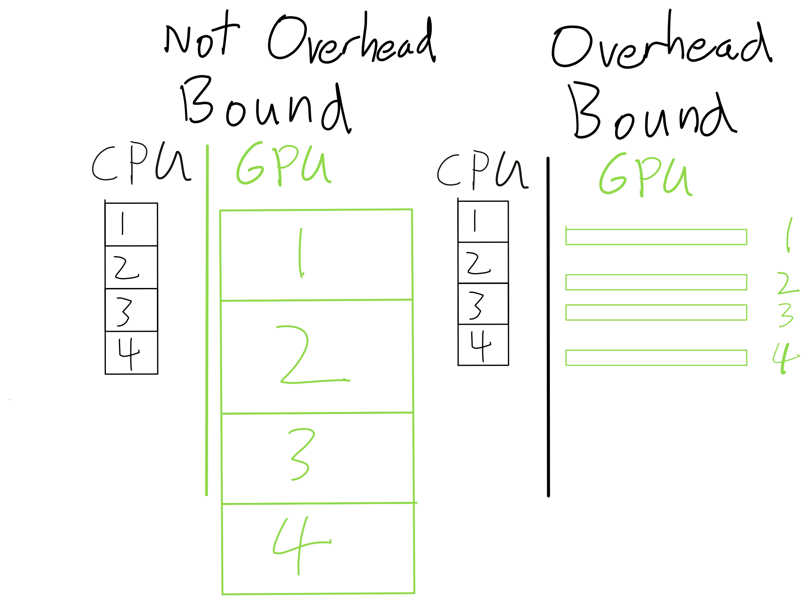</center>
<figcaption align = "center"><i>If our GPU operators are big enough, then our CPU can run ahead of the GPU (and thus the CPU overhead is irrelevant). On the other hand, if our GPU operators are too small, then our GPU is going to spend most of its time as an expensive paperweight.</i></figcaption>
</figure>


So, how do you tell if you're in this regime? Well, since overhead generally doesn't scale with problem size (while compute and memory do), the easiest way to tell is to simply increase the size of your data. If that doesn't increase the runtime proportionally, you're overhead bound. For example, if you double your batch size but your runtime only increases by 10%, you're likely overhead bound. [^batch_size]

Another way is to use the PyTorch profiler. Here, the pink lines actually show how the CPU kernels match up with the GPU kernels.

<figure>
<center>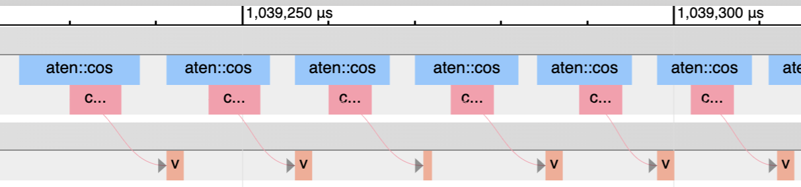</center>
<figcaption align = "center"><i>Lots of gaps on the GPU while it's waiting for CPU overhead</i></figcaption>
</figure>

<figure>
<center>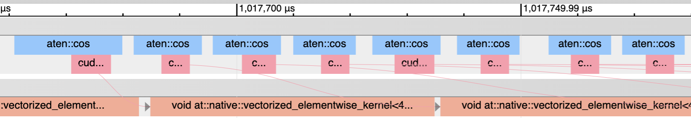</center>
<figcaption align = "center"><i>Our CPU runs wayyy ahead of the GPU</i></figcaption>
</figure>

Another aside - the "GPU-Util" ([not "Volatile GPU-Util"](https://twitter.com/cHHillee/status/1500547396945670144)) entry in nvidia-smi is basically measuring what percentage of the bottom row is actually running a GPU kernel. So that's another good way of eyeballing overhead.

The primary reason this overhead exists is due to all of the flexibility frameworks like PyTorch have. Essentially, a lot of time needs to be spent on "figuring out what to do". 

This might be from Python (looking up attributes or dispatching to the right function) or code in PyTorch (all of PyTorch's [dispatcher](http://blog.ezyang.com/2020/09/lets-talk-about-the-pytorch-dispatcher/)). For example, when you do `a + b`, the following steps need to happen.

1. Python needs to look up what `__add__` dispatches to on `a`.
2. PyTorch needs to determine many attributes of the tensor (such as dtype, device, and whether autograd is needed) to determine which kernel to call.
3. PyTorch needs to actually launch the kernel.

Fundamentally, this overhead comes from the flexibility of being able to do something different at each step. If you don't need this flexibility, one way of resolving this flexibility is by tracing it out, like with `jit.trace`, `FX`, or `jax.jit`. Or, alternately, you could do it at an even lower level with something like [CUDA Graphs](https://pytorch.org/blog/accelerating-pytorch-with-cuda-graphs/).

Unfortunately, this comes at the cost of losing flexibility. One approach I'm excited about that could get us the best of both worlds is to write something more along the lines of a "real" JIT by introspecting at the VM level. See [TorchDynamo](https://dev-discuss.pytorch.org/t/torchdynamo-an-experiment-in-dynamic-python-bytecode-transformation/361) for more on this.

## Conclusion
If you want to speed up your deep learning system, the most important thing is to understand what the bottleneck in your model is. That bottleneck determines what the appropriate way of speeding up your system is.

Often, I see researchers and other folks interested in speeding up their PyTorch code try things out blindly without an understanding of what regime you're in. 

| Performance Regime      | Plausible Solutions |
| ----------- | ----------- |
| Overhead-Bound      | Tracing, Operator Fusion, don't use Python, a *real* JIT :^) |
| Bandwidth-Bound   | Operator Fusion |
| Compute-Bound | Use Tensor Cores, give Nvidia more money |

Of course, arguably, users needing to think about this stuff at all reflects a failure on the part of the framework. PyTorch's compiler or profile APIs haven't always been the ... easiest to work with, although it is an active area of focus.

Regardless, I find understanding of basic principles of systems to nearly always be useful - hopefully this was useful to you as well.

#### Acknowledgements
Thanks to Emily Shen, Qian Huang, and folks on EleutherAI for reading earlier drafts of this blog post and providing feedback.

[^batch_size]: This isn't *strictly* the only reason why increasing batch size might not increase computational time accordingly - in certain regimes it also increases computational intensity. For example, in a MLP you're typically doing [B, D] x [D, D] matmuls. If B is less than D (say, your batch size is 1 while your hidden dim is 128), then you might negligibly increase your total memory bandwidth, while doubling your compute. I couldn't figure out a way to explain this nuance easily though.
[^fma]:  This might not be what you see on the spec sheet, where it says 19.5 teraflops. The reason for this is that GPUs have even *more* specialized hardware for fused multiply and add (FMA) instructions. So, for fully general purpose computation, an A100 actually only achieves 9.75 teraflops. 
[^flop_count]: There are a lot of way to count FLOPS, but this is actually fairly trivial to do in a nice way in PyTorch now - see https://dev-discuss.pytorch.org/t/the-ideal-pytorch-flop-counter-with-torch-dispatch/505