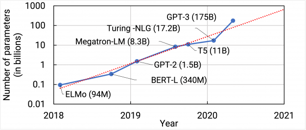
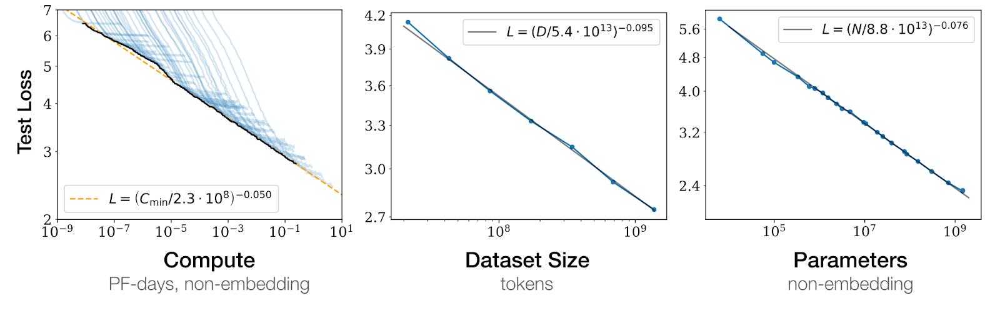
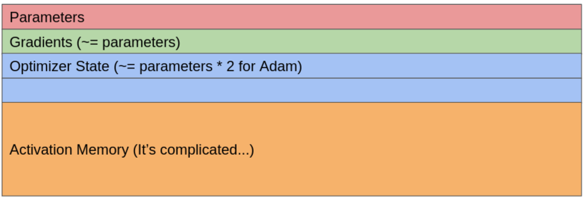

# An Overview of Scaling Deep Learning Models

Over the last several years, there's been a lot of interest in scaling. From GPT-3 to Dall-E, we now routinely see models with hundreds of billions of parameters. And the scaling shows no signs of stopping (mostly).

The race to supersize our models is driven by more than blind faith, however. Recent papers have shown that the performance of deep learning models improves predictably as we increase the model size and size of the dataset. After the success of GPT-2, OpenAI was not simply *hoping* that a 100x larger model would perform better, they were able to reliably predict *how* much better the model was, using something called scaling laws.

These scaling laws provide a relationship between compute, data, and model performance, and have been shown to exist for a wide variety of models (insert link here).

So, even if you weary of transformers and hope that transformers are going to be replaced by the next big thing, you're not going to be able to avoid scaling. Whether it's hyperbolic neural networks, neuro-symbolic methods, knowledge graphs, or whatever pet method you believe in, scaling will likely be a reliable lever to improve its performance.

But, how do you actually scale your model? You may have heard of data parallel and model parallel, but what's this new ZeRO thing Microsoft's been pushing? And what's 4-D parallelism? And how do I choose which one to actually use?

Well, that's what this overview is for!

## What do I need to worry about when scaling models?
Unlike training on a single GPU, there are some additional constraints to worry about for large models.
#### 1. Memory
The most obvious issue with training large models is memory constraints. GPT-3 consists of 175 billion parameters. Assuming that one uses 32-bit floats (not necessarily true), this comes out to 1.4 terabytes of memory for the parameters alone! Assuming a Nvidia V100 with 32 gigabytes of memory, you'd need **45** GPUs to hold the parameters alone.

#### 2. Computation
After you've fit your model onto your devices, you run into your next problem - actually doing the computation. GPT-3 took 3640 Petaflop days to train. Once again assuming a Nvidia V100 with 130 teraflops, this comes out to 672 thousand V100 hours.

#### 3. Communication
Although GPT-3 could theoretically be trained with 672 thousand V100 hours, it actually used 3.5 *million* V100 hours, at 20% utilization. The primary reason for this is the 3rd main consideration - communication costs. In most cases, scaling large models is often about reducing your communication bottleneck as much as possible.

### Where did my memory go?
Before tackling memory constraints, we need to understand how our memory is being used in the first place. Many ML practitioners often find this surprising.

1. **Parameters**: The memory used by your parameters is simply equal to your parameter count multiplied by the size of each parameter.

2. **Gradients**: After computing your backwards pass, you'll have one value for each one of your parameters before you pass it to your optimizer. Thus, your gradients use the same memory as your parameters.

3. **Optimizer**: Surprisingly, your optimizer state is typically *larger* than your parameters! This is since common optimizers (like Adam) typically store multiple values per parameter. If you used SGD, your optimizer would take no memory. SGD + momentum would mean that your optimizer uses the same memory as your parameters. Adam means that your optimizer would use double the memory as your parameters!

4. **Activation memory**: This is the most complicated aspect of memory to calculate, as it's highly dependent on your specific model architecture and training setup. In general, this is the primary consideration for smaller models, but becomes less important for larger ones.

<b> Heuristic for thinking about activation memory </b>

One heuristic for thinking about your activation memory is that it's proportional to the number of input-dependent values you have flowing through your network. So, for example, if you double your batch size, you double the amount of input-dependent values, and you double your activation memory requirements. Similarly, for a convolutional neural network (CNN), increasing your image size increases the sizes of your feature maps, and thus, increases your activation memory without increasing your parameter count.

<b> How much does activation memory matter? </b>

Although it may seem like activation memory will easily be the largest source of memory, activation memory is also one of the easiest types of memory to reduce, whether through data-parallelism, activation checkpointing (i.e. tensor rematerialization), or any other kind of parallelization. As a result, activation memory does not usually end up being the primary consideration for sufficiently large models.

Overall, the memory breakdown looks like this. Not all memory is created equal - different techniques reduce different parts of the memory.

## The Different Types of Parallelism
First of all, let's review the different components of training a machine learning model. At a high level, we pass data and parameters into our model, which runs a forwards and backwards pass. This gives us our gradients, which we pass into our optimizer. Our optimizer then gives us back our new parameters.

insert overall flow image here

### Data Parallelism
Data Parallelism is one of the most straightforward kinds of parallelism, and is usually the first technique you should reach for.

At its core, the technique is simple. We already run our models on multiple examples in parallel (people call this "batching"), so let's just run our models on even **more** examples, but this time split across multiple GPUs.

<!-- So, our training diagram from above now looks like this:

insert data-parallelism diagram here -->

So, let's imagine that we do data-parallelism, and we clone whatever we did on one device, but on multiple devices! So,

### Zero

## Model Parallelism

## Pipeline Parallelism

2.

1. Considerations
Memory Usage
Communication
Computation
Batch Sizes
    Critical Batch Sizes

1. Memory usage
Parameter Memory
Optimizer Memory
Gradient Memory
Activation Memory (i.e. save for backwards pass)
    - Complicated, but rule of thumb for transformers is sqrt(params) * seq_length * batch_size

Methods of Reducing Memory Usage:
Data Parallelism (activation memory)
Gradient Accumulation (activation memory)
Gradient Checkpointing/Rematerialization (activation memory)
    RevNets
Zero 1 (optimizer memory)
Zero 2 (gradient memory)
Zero 3 (parameter memory)

2. Model-Parallelism
