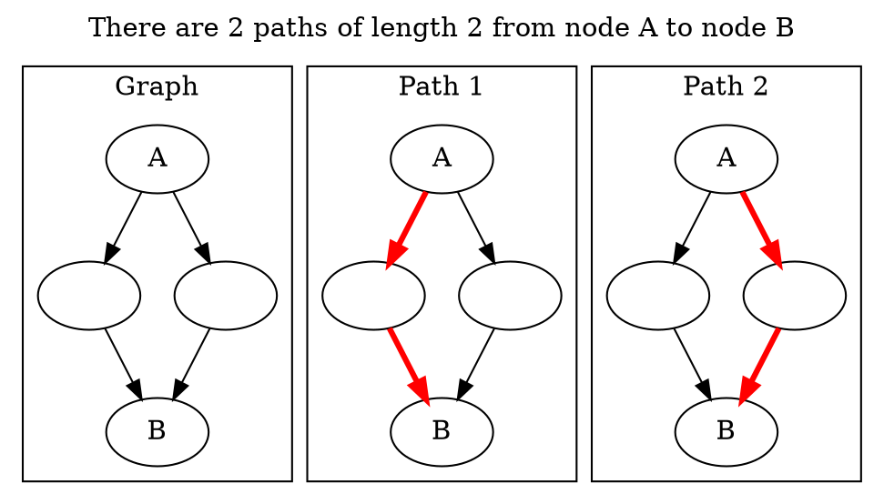
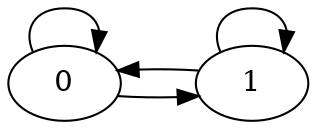
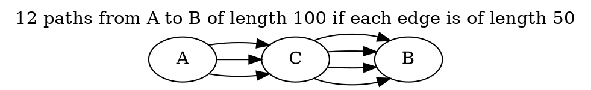
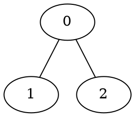

# How Many Paths of Length K are there? : And I Show You How Deep the Rabbit Hole Goes...
Here's a (surprisingly interesting) programming problem: Given a directed unweighted graph with V vertices and E edges, how many paths of length K are there from node A to node B? Paths may visit the same node or edge multiple times[^walkpath]. To avoid dealing with very large numbers, assume that we're computing our answer modulo a large prime.



This problem is fairly standard -  many of you may have seen it or heard it in an interview. Personally, I've seen this problem on Hackernews in some form at least three times, [here](https://news.ycombinator.com/item?id=22953404), [here](https://news.ycombinator.com/item?id=19193405), and [here](https://news.ycombinator.com/item?id=17758800).

I found this comment from the last link particularly interesting.


He states of the most advanced level:
> I've never seen anyone get this and I only learned about it after months of asking this question.

And that's where he left the problem. Seems like a pretty cool problem with plenty of depth, doesn't it?

As it turns out, this problem has even more depth than that Google interviewer thought. What if I told you, that drawing on concepts from coding theory, abstract algebra, and signal processing, we could solve this problem in $O(EV + V \log V \log K)$ time?

To my knowledge, despite being a common problem, I have not seen this faster solution presented anywhere.

Let's dive down the rabbit hole of solutions to this problem, starting from the top.


## The Brute Force Solution ($V \leq 5, K\leq 5$)
The most straightforward solution to this problem is to enumerate all the paths and stopping once our path reaches K nodes. We can implement it with a breadth first search, like so:

```python
ans = 0
queue = [(A, 0)] # We track (length of walk, current node)
while not queue.empty():
    curNode, curLength = queue.front()
    queue.pop()
    if curLength == K:
        if curNode == B:
            ans += 1
        break
    for neighbor in neighbors(curNode):
        queue.push((neighbor, curLength + 1))
```
However, this solution is exponential. Take this simple graph



Let's count the number of paths of length K from node 0 to node 1. We see that any sequence of 0s and 1s that ends at node 1 is a valid path, implying that there are $2^K$ valid paths. As this solution counts each valid path separately, it must be doing exponential work as well.

An interviewer (like that Googler) wouldn't be too impressed.

## Dynamic Programming ($E \leq 5000, K \leq 5000$)
Looking at the above solution, we notice that there is a lot of wasted work - our queue will often visit the same state many times. For example, we'll visit node B with a path of length K as many times as our answer. Noticing that the same state is visited multiple times naturally leads to a dynamic programming solution.

In this case, we choose the same state as we did in our above problem: (node, length). This time, however, we consolidate all of our redundant states.

Thus, `dp[node][length] = sum(dp[neighbors(node)][length-1])`.


```python
dp[A][0] = 1
for length in 0..K:
    for node in 0..N:
        for neighbor in neighbors(node):
            dp[node][length] += dp[neighbor][length-1]
```

We can either do this iteratively (which allows us to reduce memory complexity by only storing one layer of DP at a time), or recursively with memoization. I've presented the iterative solution above.

The complexity of this solution is $O(EK)$. So far, this seems like a standard DP problem. Most interviewers would probably be satisfied with this solution.

We aren't. :^)

## A Neat Trick With Adjacency Matrices ($V \leq 500, K \leq 1 \text{ billion}$)
If there aren't many nodes but $K$ is extremely large, then we need to give up on the above DP approach. The naive approach above finds the answer for "how many paths of length $K-1$" before it finds the answer to "how many paths of length $K$". As a result, even if we **could** find the answer for $K$ from the answer for $K-1$ in constant time, we wouldn't be able to solve this problem with the above constraints.

There's 2 different ways to proceed. The first is to note that we don't actually *need* the answer for $K-1$ before we can find the answer for $K$. For example, if we know that that there are 3 paths of length 50 from A to C and 4 paths of length 50 from C to B, then there are $3 \cdot 4$ paths of length 100 from A to B with C at the midpoint. More generally, consider any node C. The number of paths from A to B of length $K$ that include C at the midpoint is the number of paths from A to C of half length multiplied by the number of paths from C to B of half length. If we sum over all possible nodes for C, then we have our answer for $K$.



This allows us to remove our linear dependence on $K$ and transforms it into a logarithmic one, for a $ V^3 \log K$ algorithm.

Using graph theory, however, there's an even easier way to come up with this algorithm. One way to represent graphs is as an adjacency matrix $A$. If one views the values in $A_{ij}$ as the number of edges between $i$ and $j$, then $A_{ij}^k$ represents the number of paths between $i$ and $j$ of length $k$.

Thus, this problem has been reduced to computing $A^k$ (i.e: matrix power). This is a standard problem that can be done in $V^3 \log K$ time through [binary exponentiation](https://news.ycombinator.com/item?id=22946710).

The two approaches outlined above end up being identical, but use radically different approaches. The difficulty of the first approach lies in thinking about first principles, while the difficulty of the second approach lies in abstracting the problem to matrices. However, once you've abstracted the problem appropriately, the solution becomes obvious.


## Going Even Deeper... ($V \leq 10000, E \leq 10000, K \leq 1 \text{ billion}$)
For the vast majority of people (including the aforementioned HN commenter), their ability to solve this problem stops here. And thus far, I've covered nothing that existing articles haven't already done (see [this](http://www.math.ucsd.edu/~gptesler/184a/slides/184a_ch10.3slides_17-handout.pdf) or [this](https://www.geeksforgeeks.org/count-possible-paths-source-destination-exactly-k-edges/)).

At this point, unfortunately, it's not clear how to proceed with standard approaches. We've already used dynamic programming to reduce unneeded work, and then we even reduced the problem to matrix exponentiation. But how can we perform matrix exponentiation even faster?

One approach when we're stuck is to convert our problem into another abstraction. In this case, a concept that's closely related to matrix exponentiation is linear recurrences.

### Linear Recurrences
A linear recurrence is a recurrence like: $a_k = 3a_{k-1} + 2a_{k-2} - a_{k-3}$. One famous example of a linear recurrence is the Fibonacci series (itself an inexplicably popular interview problem)[^fibonacci]. The linear recurrence for Fibonacci can be written as $A_k = A_{k-1} + A_{k-2}$. The order of a linear recurrence is the number of terms it depends on. So, the first example would have order 3, and Fibonacci would have order 2.

How are linear recurrences tied to matrix exponentiation? Well, you might know that finding the $K$-th Fibonacci number can be done in $\log(K)$ time using [matrix exponentiation](https://www.nayuki.io/page/fast-fibonacci-algorithms). In fact, this is a special case of the more general algorithm to find the $K$-th term of any order $N$ linear recurrence using matrix exponentiation in $O(N^3 \log K)$ time. This is a [good resource if you're unfamiliar](https://community.topcoder.com/tc?module=Static&d1=features&d2=010408).

So, we can convert a linear recurrence problem to a matrix exponentiation problem. Clearly, there is some connection here. Sadly, as we currently have a matrix exponentiation problem, this doesn't immediately help. Could we be lucky enough to have a way to turn a matrix exponentiation problem into a linear recurrence problem?

### Enter Cayley Hamilton
[Wikipedia](https://en.wikipedia.org/wiki/Cayley%E2%80%93Hamilton_theorem) writes that

> If A is a given n×n matrix and $I_n$  is the n×n identity matrix, then the characteristic polynomial of A is defined as
> $${\displaystyle p(\lambda )=\det(\lambda I_{n}-A)~}$$

Not immediately helpful (to me at least). However, several lines down we see that
> The [Cayley Hamilton] theorem allows A^n to be expressed as a linear combination of the lower matrix powers of A.

In other words, we know that this equation holds true for some values of $x_i$.

$$A^n = x_0I + x_1A + x_2A^2 ...$$

In other words, we are **guaranteed** that the powers of $A$ form a linear recurrence! This is not obvious at all, but it does highlight some of the powers of math. Good job, Cayley Hamilton.[^cayley]

Now that we know that matrix exponentiation problems can be converted to a linear recurrence problem, this doesn't help us unless we can calculate the k-th term of a linear recurrence faster than we compute the k-th power of a matrix. So... can we?

As you may have inferred, yes! But to do so, we must first take a small detour into polynomials and generating functions.

#### Polynomials and Generating Functions
Let's define a (kinda weird) function $G$, which takes in a polynomial and replaces $x^k$ with the $k$-th term in our linear recurrence. More formally, given a polynomial $f(x) = \sum c_i x^i$, $G(f)$ returns $\sum c_i a_i$.

So, for Fibonacci, $G(x^0)=1$, $G(x^1) = 1$, $G(x^2) = 2$, $G(x^3)=3$, $G(x^4)=5$, $G(x^5)=8$, and $G(x^k) = k$-th Fibonacci element (ie: $A_k$). $G(x^2 + x^3) = A_2 + A_3 = 5$. Finally, $G$ is also a linear function, which means that $G(f+g) = G(f) + G(g)$.

Some more examples:
\[G(x(x^2 + 2x^3)) = G(x^3 + 2x^4) = A_3 + 2A_4 = 3 + 2\cdot 5 = 13 \]
\[G(x^{20} + 3) = A_{20} + 3A_0 = 6765 + 3 = 6768\]

If someone gave us a magical black box to evaluate $G$, we could simply evaluate $G(x^k)$ and get our answer! Unfortunately, no such box exists (I wish). If $k$ was small enough, we could compute the terms up to $k$ ourselves. But needing to computing the terms up to $k$ ourselves puts us back where we started.

Another way we could evaluate $G(x^k)$ is to find a polynomial equivalent to $G(x^k)$ and evaluate that instead. And if this polynomial had low degree, then evaluating this function would be easy.

For example, this is one way to find an equivalent polynomial of lower degree:
\[G(x^5) = G(x^3 + x^4) = G(x^3 + (x^2 + x^3)) = G(2x^2 + 3x^3) = 2F_2 + 3F_3 = 8\]

Note that despite the fact that $G(2x^2 + 3x^3)$ represents $G(x^5)$, we only needed to know Fibonacci values up to $G(x^3)$.

Thus, if we could easily compute a polynomial $h$ with low degree such that $G(x^k) = G(h)$, we would be done! In order to do so, however, we need one final detour into the ominously named "annihilator" polynomials.

#### Annihilation

An annihilator is a non-zero polynomial $f$ such that $G(f) = 0$. On Fibonacci, for example, examples of annihilators would be $x^3 - x^2 - x^1$ or $x^6 - x^5 - x^4$. Remember that $G$ turns polynomial terms into Fibonacci terms. So, plugging in the last annihilator into $G$ provides us $G(x^6 - x^5 - x^4) \implies F_6 - F_5 - F_4 = 0 \implies F_6 = F_4 + F_5$. In other words, the 6th Fibonacci term is equal to the 5th and 4th Fibonacci terms added together.

Note that the last statement is clearly true. After all, that's the definition of Fibonacci.

This observation leads to an easy way of generating annihilators: We just use the definition of our linear recurrence! If the n-th term of our linear recurrence is some combination of the previous terms, then the n-th term minus those previous terms is equal to $0$.

For illustration, let's take the linear recurrence $a_n = a_{n-1} - 2a_{n-2} + 3a_{n-3}$. Specifically, $a_3 = a_2 - 2a_1 + 3a_0$. This implies that $a_3 - a_2 + 2a_1 - 3a_0 = 0$. Thus, one annihilator is $x^3 - x^2 + 2x - 3$. We can repeat this process with $a_4$ to get the annihilator $x^4 - x^3 + 2x^2 - 3x$ or $a_{100}$ to get the annihilator $x^{100} - x^{99} + 2x^{98} - 3x^{97}$. Note that we can also generate these other annihilators by multiplying the annihilator for $a_3$ by $x^n$.

Since $G(fx) = G(fx^2) = G(fx^3)  = ...= 0$, this means that $G(fg) = 0$, where $g$ can be any polynomial. For example, $G(f(x^3 + x^7)) = G(fx^3 + fx^7) = G(fx^3) + G(fx^7) = 0$.

#### Computing the K-th term of a linear recurrence with polynomials
Now, we know how to represent linear recurrences with generating functions, and we even know what an annihilator is. But how does that allow us to do anything useful?

Let's take one final digression into normal integer arithmetic. For any integer $a$ and $b$ where $a < b$, we can write $b$ as $d\cdot a + (b \mod a)$ for some integer $d$. For example, for $a=7$ and $b=30$, we can write $30 = 4\cdot 7 + (30 \mod 7)$.

We can apply a similar concept to polynomials [^2]. For any polynomial $a$ and $b$ where $a$ has lower degree than $b$, we can write $b$ as $d\cdot a + (b\mod a)$, where $d$ is some polynomial.

Now, this is where it all comes together. Let's plug in $a = f$ (our annihilator) and $b = x^k$ (the term we're looking for).

\[x^k = d\cdot f + (x^k \mod f)\]

We don't know what $d$ is, but remember that $f$ is an annihilator. Thus, no matter what $d$ is, $G(d\cdot f) = 0$ and we can ignore it! This also implies that $G(x^k) = G(x^k \mod f)$, and since $x^k \mod f$ is a polynomial with low degree, we can evaluate $G(x^k \mod f)$ easily!

Calculating $x^k \mod f$ can be done with $\log k$ polynomial multiplication and polynomial modulo. Using the Fast Fourier Transform, we can do each of these in $n \log n$ time.[^fft]

Now that we've computed $x^k \mod f$, which has low degree, we can easily evaluate $G(x^k \mod f)$.

Thus, we can find the $K$-th term of an order $N$ linear recurrence in $N \log N \log K$ time.

### Recovering the Linear Recurrence with Berlekamp-Massey
As this point, an astute reader might point out that although, due to Cayley Hamilton, we know that a linear recurrence *exists* that corresponds to our problems, and that, due to polynomials and annihilators, we know how to compute the K-th term of a linear recurrence quickly, we **don't** know how to actually recover the sequence. Enter Berlekamp-Massey.

[Wikipedia states that](https://en.wikipedia.org/wiki/Berlekamp%E2%80%93Massey_algorithm):

> The Berlekamp–Massey algorithm is an algorithm that will find the shortest linear feedback shift register (LFSR) for a given binary output sequence.

I couldn't tell you what a Linear Feedback Shift Register is, but I **can** tell you what Berlekamp Massey does. Given a sequence of terms, it finds the shortest linear recurrence that fits all of the terms. If you pass in $2L$ terms, it's guaranteed that the shortest linear recurrence is of order $\leq L$. For example, if you pass $1, 1, 2, 3$ it will provide you the Fibonacci sequence. And it'll do it in $N^2$ time! It's basically magic.

There's only one last wrinkle - Berlekamp Massey doesn't operate on matrices. However, note that Cayley-Hamilton doesn't merely imply that the matrices satisfy some linear recurrence, it also implies that each individual element satisfies a linear recurrence. For example, $A^n_{0,0} = x_0 + x_1A_{0,0} + x_2A^2_{0,0}...$

Thus, if we're trying to count the number of paths from node A to node B, we can simply pass $I_{a,b}, A_{a,b},A^2_{a,b}...$ to Berlekamp-Massey. As our linear recurrence is order $N$, we need to pass in the first $2N$ terms of $A^i$.

As our DP approach lets us find all the values of $A^i$ up to $A^k$ in $EK$ time, this allows us to compute all of the necessary terms in $EV$ time and the corresponding linear recurrence in $V^2$ time.

And that's it! Finally, we can compute the number of paths of length K from node A to node B!

Pseudocode for this entire process.
```python
Compute dp matrix
initial_terms = [dp[i][B] for i in 0..2*N]
linear_recurrence = berlekamp_massey(initial_terms)
ans = get_kth_term(linear_recurrence, initial_terms, K)
```

Code for this last approach can be found [here.](./walks.cpp) The code templates are taken from the amazing ICPC template library [KACTL](https://github.com/kth-competitive-programming/kactl) (which deserves a whole separate article).

# Concluding Thoughts
Hope you found this a neat rabbit hole to dive into! This problem is one that many may have encountered, whether in class or interviews. Although many of you may have written it off as a basic DP problem (or perhaps after encountering the adjacency matrix interpretation), there's actually a lot more depth to this problem than you may have expected.

Besides the problem-specific lessons, this problem also illustrates a lesson on how math can become quite helpful even on problems where math didn't originally seem relevant. At the beginning, this problem seemed like your typical interview fare (zzz), but as we kept pushing the limits of this problem we ended up needing more and more math. In the end, we needed to start citing cutting-edge research papers (See Further Extensions).

### Acknowledgements
I'd like to thank the competitive programming discord AC, and in particular `pajenegod`, who both came up with this technique and explained it to me! I'd also like to thank the competitive programming community on [Codeforces](https://codeforces.com/).

## Further Extensions
### Q: What if you wanted all the terms of $A^k$, instead of just one?
Our approach currently only provides us one of the $N^2$ terms. Naively, we could try using the linear recurrence we found for a single element and use it for all of the other terms. Unfortunately, this doesn't work. The most obvious counterexample is when the graph is disconnected. Obviously, the paths in one component provides no information about paths in a different connected component. However, even if we restrict ourselves to the case where the graph is connected, it's not guaranteed that a linear recurrence found for one element in $A$ will generalize to the whole matrix. For example, take this undirected graph



The number of paths from 0->1 follow the sequence `0,1,0,2,0,4...`, a linear recurrence of order 2, while the number of paths from 2 -> 1 follow the sequence `0,0,1,0,2,0,4...`, a linear recurrence of order 3.


One intuition for why this doesn't work is that information about a single node isn't enough for the whole graph. Information might not reach that node or it might be cancelled out. One thing we can try is to find the linear recurrence of $a\cdot A^n_{0,0} + b\cdot A^n_{1,1} = (aI_{0,0} + bI_{1,1}) + (aA_{0,0} + bA_{1,1})...$. In other words, we take a random linear combination of the elements of our matrix, and hope that this allows us to recover the linear recurrence for the whole matrix. But how well does this work?

As it turns out, the procedure we use here is actually very similar to something called the Coppersmith algorithm. Corollary 22 of [this paper](https://sci-hub.tw/https://www.sciencedirect.com/science/article/pii/S0747717115000528) states that the procedure outlined above succeeds with probability $(1-1/q)^{2n}$, where $q$ is the cardinality of our finite field (how big our mod is). Thus, with high probability our method will recover the linear recurrence for the whole graph!

Thus, we can actually use this method to find $m$ different values of $A^k$ (assuming that $q \gg n$) in $V^3 + $m \cdot V \log V \log K$.

### Q: Why don't we just diagonalize the matrix and compute $A^k$ that way?
If the matrix was diagonalizable (e.g: undirected graph), and we weren't computing over a finite field, we could - if we didn't care about floating point precision.  We can't solve this problem by diagonalizing your matrix over a finite field either. Symmetric matrices are not guaranteed to be diagonalizable over finite fields.

For directed graphs, we could also compute the Jordan Normal Form, but we run into the same issues.


[^walkpath]: - Some computer scientists will tell you that the correct terminology should be walk, but I suspect most programmers are more familiar with the term "path". Solving this problem for actual (simple) paths is NP-Complete, as setting $K=N$ reduces this problem to Hamiltonian Path.
[^fibonacci]: - My suspicion is that programmers love to pretend they're mathematicians.
[^cayley]: - I suppose this is the right place to confess that when Cayley Hamilton was first presented in my math classes, I did not understand my textbook's enthusiasm about the beauty of the Cayley Hamilton theorem. However, I found this application much more convincing.
[^fft]: - If you don't understand how to use FFT to compute polynomial multiplication in $N \log N$ time, I highly recommend learning about it [here](http://jeffe.cs.illinois.edu/teaching/algorithms/notes/A-fft.pdf). Not only is it a very cool concept that'll teach you things about polynomials and complex numbers, it will also teach you about the difficulty of writing efficient array code when your naive FFT runs 3 orders of magnitude slower than a good one, despite having the same complexity.
[^2]: - This is a general property of Euclidean rings.