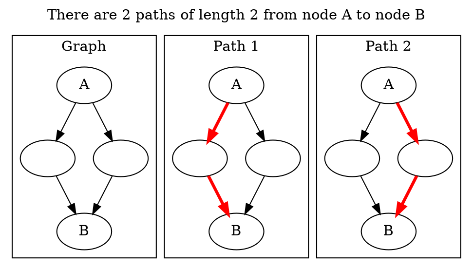
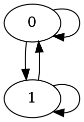

# How Many Paths of Length K are there? : And I Show You How Deep the Rabbit Hole Goes...
Here's a programming problem: Given an undirected unweighted graph with V vertices and E edges, how many paths of length K are there from node A to node B? Here, we allow paths to visit the same node or edge multiple times. [^1]



I have seen this problem on Hackernews in some form at least twice, both [here](https://news.ycombinator.com/item?id=22953404) and [here](https://news.ycombinator.com/item?id=17758800). Quotes from the the second link: "I also work at Google... I used to love asking this question until it was banned", and outlines 4 different levels of solution, stating of the the most advanced level: "I've never seen anyone get this and I only learned about it after months of asking this question." Well, I'm glad to say that that there's even **more** depth to this problem than his etymology.

However, he is right that there are several levels of solutions to this problem, however. There's a trivial exponential solution. If you're familiar with programming interviews, you might come up a dynamic programming solution in $O(EK)$ time. If you're particularly clever and knows some graph theory, you might even know how to solve it with matrix exponentiation in $O(V^3 \log K)$ time. You might think that's the end to this problem. For most purposes, you'd be right.

But, what if I told you that this problem has even more depth than you thought? What if I told you that, drawing on concepts from coding theory, abstract algebra, and signal processing, we could solve this problem in $O(EV + V \log V \log K)$ time?

Let's take a really deep dive into this problem. We'll start at the top, but after that...

## The Obvious Brute Force Solution ($V \leq 5, K\leq 5$)
The most straightforward solution to this problem would be to simply enumerate all the paths, stopping once our path reaches K nodes. One might implement it with a breadth first search like so:

```python
ans = 0
queue = [(A, 0)] # We track (length of walk, current node)
while not queue.empty():
    curNode, curLength = queue.front()
    queue.pop()
    if curLength == K:
        if curNode == B:
            ans += 1
        break
    for neighbor in neighbors(curNode):
        queue.push((neighbor, curLength + 1))
```
However, we see that this is exponential. At the very least, this solution needs to do an amount of work equal to the number of paths found (as we add 1 for each path found).

Take this simple graph


Let's count the number of paths of length K from node 0 to node 1. We see that any sequence of 0s and 1s that ends at node 1 is a valid path, implying that there are $2^K$ valid paths.

Thus, this solution is exponential. An interviewer probably wouldn't be too impressed.

## Dynamic Programming ($E \leq 5000, K \leq 5000$)
Looking at the above solution, we notice that there is a lot of wasted work being done. Our queue will often visit the exact same state many times. For example, we'll visit (B, K) a number of times equal to our answer. When we see that we're visiting the same state multiple times, a dynamic programming solution is natural.

In this case, we can choose the same state as we did in our above problem: (node, length). However, we will make sure to consolidate all of our redundant states.

Thus, `dp[node][length] = sum dp[neighbors(node)][length-1]`.


```python
dp[A][0] = 1
for length in 0..K:
    for node in 0..N:
        for neighbor in neighbors(node):
            dp[node][length] += dp[neighbor][length-1]
```

You can either do this iteratively (which opens up the door for reducing the memory by only storing one layer at node at a time), or recursively with memoization.

The complexity of this solution is $O(EK)$. So far, a pretty straightforward DP problem. This would probably be what an interviewer would be looking for.

## A Neat Trick With Adjacency Matrices ($V \leq 500, K \leq 1e9$)
If there aren't many nodes, but $K$ is extremely large, then we need to give up on the naive DP approach. The naive approach finds the answer for "how many paths of length K-1" before it finds the answer to "how many paths of length K". As a result, even if we **could** find the answer for K from the answer for K-1 in constant time, we wouldn't be able to solve this problem with the above constraints.

There's 2 ways to proceed. First, we could note that we don't actually **need** the answer for $K-1$ before we can find the answer for $K$. For example, if we know that that there are 5 paths of length 50 from A to B and 7 paths of length 50 from B to C, then there are `5*7` paths of length 100 from A to B to C. More concretely, consider any node C. The number of paths from A to B that include C at the `K/2`th step is the number of paths from A to C of length `K/2` multiplied by the number of paths from C to B of length `K/2`. If we sum over all possible nodes for `C`, then we have our answer for `K/2`.

This allows us to remove our linear dependence on `K`, and transforms it into a logarithmic one, for a $ V^3 \log K$ algorithm.

However, there's an even easier way to come up with this algorithm. One representation for graphs is as an adjacency matrix $A$. If one views the values in $A_{ij}$ as the number of edges between $i$ and $j$, then $A_{ij}^k$ represents the number of paths between $i$ and $j$ of length $k$.

Thus, this problem has been reduced to computing $A^k$ (i.e: matrix exponentiation). This is a common problem that can be done in $V^3 \log K$ time through binary exponentiation (see an explanation [here](https://news.ycombinator.com/item?id=22946710)). Note that if we didn't care about floating point precision, we could simply diagonalize the matrix and compute the answer in $V^2 + V \log K$. But who likes approaches that require floats >:(


## Going Even Deeper... ($V \leq 1e4, E \leq 1e4, K \leq 1e9$)
For most people, this is where their ability to solve this problem stops at. And thus far, I haven't introduced anything that existing articles haven't already done (see [this](http://www.math.ucsd.edu/~gptesler/184a/slides/184a_ch10.3slides_17-handout.pdf) or [this](https://www.geeksforgeeks.org/count-possible-paths-source-destination-exactly-k-edges/)).

To go even deeper, there are a few seemingly unrelated concepts we must introduce first...

### Linear Recurrences
A linear recurrence is a function like: $f_k = 3f_{k-1} + 2f_{k-2} - f_{k-3}$. The Fibonacci series is a famous linear recurrence, which can be written as $f_k = f_{k-1} + f_{k-2}$. The order of a linear recurrence is how many terms it depends on. So, the first example would have order 3, and Fibonacci would have order 2.

You might know that finding the k-th Fibonacci number can be done in $\log(k)$ time using matrix exponentiation. In fact, you can find the $k$-th term of any order $n$ linear recurrence using matrix exponentiation in $O(N^3 \log K)$ time. This is a [good resource if you're unfamiliar](https://community.topcoder.com/tc?module=Static&d1=features&d2=010408). This is simply an extension of Fast Fibonacci methods like [here](https://www.nayuki.io/page/fast-fibonacci-algorithms).

However, if we're working with linear recurrences, there's another (somewhat unintuitive) form that allows for even faster computation.

### Polynomials and Generating Functions
Let's define a (pretty weird) function $G$, which takes in any polynomial and replaces the $x^k$ with the k-th term in our linear recurrence. So, for Fibonacci,
$G(x^0)=1$, $G(x^1) = 1$, $G(x^2) = 2$, $G(x^3)=3$, $G(x^4)=5$, $G(x^5)=8$, and $G(x^k) = k$-th Fibonacci element. We can also pass in polynomials with more than one term, so $G(x^2 + x^3) = G(x^2) + G(x^3) = 5$. $G$ is also a linear function, which means that $G(f+g) = G(f) + G(g)$.

Some more examples:
\[G(x(x^2 + 2x^3)) = G(x^3 + 2x^4) = F_3 + 2F_4 = 3 + 2\cdot 5 = 13 \]
\[G(x^{20} + 3) = F_{20} + 3F_0 = 6765 + 3 = 6768\]

So, if we had an easy way of evaluating $G$, we could just do $G(x^k)$ and we'd have our answer! Unfortunately, we don't. If $k$ was small enough, we could simply compute the terms up to $k$ ourselves. Similarly, if we pass in a polynomial with a low degree, we could compute the terms up to that degree ourselves and simply plug the values in. In this way, we can actually compute values of Fibonacci that correspond to terms with degrees larger than the polynomial.

For example:
\[G(x^6) = G(x^3 + x^4) = G(x^3 + (x^2 + x^3)) = G(2x^2 + 3x^3) = 2F_2 + 3F_3 = 8\]

So, if we can find some polynomial $h$ with a low degree such that $G(x^k) = G(h)$, we would be done!

### Annihilation

Now, we need to introduce one more concept - the ominously named "annihilator" polynomial. For Fibonacci, $G(x^3) = G(x^2) + G(x^1)$, and indeed, that $G(x^k) = G(x^{k-1}) + G(x^{k-2})$. Due to the linearity of $G$, this implies that $G(x^k - x^{k-1} - x^{k-2}) = 0$. All of these polynomials where $G(f) = 0$ are "annihilators" of the sequence. We will call the annihilator with lowest degree $f$, and note that the other annihilators can be written as $f*x^k$. For Fibonacci, this would mean that $f = x^2 - x^1 - 1$. Note that this corresponds with how we typically define linear recurrences.

For example, if your linear recurrence is $f_n = f_{n-1} - 2f_{n-2} + 3f_{n-3}$, your annihilator would be $x^3 - x^2 + 2x - 3$.

Since $G(fx) = G(fx^2) = G(fx^3)  = ...= 0$, this means that $G(fg) = 0$, where $g$ can be any polynomial. For example, $G(f(x^3 + x^7)) = G(fx^3 + fx^7) = G(fx^3) + G(fx^7) = 0$.

## Computing the k-th term of a linear recurrence with polynomials
Let's take a short digression into normal integer arithmetic. For any integer $a$ and $b$ where $a < b$, we can write $b$ as $r*a + (b \mod a)$ for some integer $r$. For example, for $a=7$, $b=30$, we can write $30 = 4*7 + (30 \mod 7)$.

The same thing applies for polynomials [^2]. For any polynomial $a$ and $b$ where $a$ has lower degree than $b$, we can write $b$ as $r*a + (b\mod a)$, where $r$ is some polynomial. It isn't obvious what the modulo operation on polynomials should be, nor how it's computed. For the purposes of this blog post, I'll say... don't worry about it. Keep it as a black box.

Now, this is where the magic happens. Let's apply this to $f$ (our annihilator) and $x^k$ (the term we're looking for).

\[x^k = r*f + (x^k \mod f)\]

We don't know what `r` is, but remember that `f` is an annihilator, which means that `G(r*f) = 0`, no matter what `r` is! Thus, we know that `G(x^k) = G(x^k % f)`. As `x^k % f` is a polynomial with low degree, we can evaluate `G(x^k % f)` easily.

Calculating `x^k % f` can be done with binary exponentiation (using polynomial multiplication) and polynomial modulo.

## Cayley Hamilton
As mentioned previously, we know that finding the $k$-th term of any linear recurrence can be reduced to finding the $k$-th power of a matrix. But, how do we know finding the $k$-th power of a matrix can be reduced to finding the $k$-th term of a linear recurrence?

[Wikipedia](https://en.wikipedia.org/wiki/Cayley%E2%80%93Hamilton_theorem) writes that

> If A is a given n×n matrix and $I_n$  is the n×n identity matrix, then the characteristic polynomial of A is defined as
> $${\displaystyle p(\lambda )=\det(\lambda I_{n}-A)~}$$

Not immediately helpful. However, several lines down Wikipedia writes that
> The theorem allows A^n to be expressed as a linear combination of the lower matrix powers of A.

In other words, we know that this equation holds true for some values of $x_i$.

$$A^n = x_0I + x_1A + x_2A^2 ...$$

In other words, we are **guaranteed** that the powers of $A$ form a linear recurrence! This is not obvious at all, but it does highlight some of the powers of math. Who would have thought that what seemed like a simple DP problem would connect with a fundamental linear algebra theorem?

So that's cool and all, but how exactly do we recover this linear recurrence from the matrix? Enter a fairly obscure algorithm from coding theory.

## Berlekamp-Massey

Wikipedia states that

> The Berlekamp–Massey algorithm is an algorithm that will find the shortest linear feedback shift register (LFSR) for a given binary output sequence.

I couldn't tell you what a Linear Feedback Shift Register is, but I **can** tell you what Berlekamp Massey does. Given a sequence of terms, it finds the shortest linear recurrence that fits all of the terms. If you pass in $2L$ terms, it's guaranteed that the shortest linear recurrence is of order $\leq L$. For example, if you pass $1, 1, 2, 3$ it will provide you the Fibonacci sequence. And it'll do it in $N^2$ time!

There's only last wrinkle - Berlekamp Massey doesn't operate on matrices. However, note that Cayley-Hamilton doesn't just imply that the matrices as a whole satisfy some linear recurrence, they also imply that each individual element satisfy a linear recurrence. For example, $A^n_{0,0} = x_0 + x_1A_{0,0} + x_2A^2_{0,0}...$

Thus, if we're trying to count the number of paths from node a to node b, we can simply pass $I_{a,b}, A_{a,b},A^2_{a,b}...$ to Berlekamp-Massey. As our linear recurrence is order $n$ (remember that order is the number of terms each term in the linear recurrence depends on), we need to pass in the first $2N$ terms of $A^i$.

As our DP approach lets us find all the values of $A^i$ up to $A^k$ in $EK$ time, this allows us to compute all of the necessary terms in $EV$ time, and the corresponding linear recurrence in $V^2$ time. Finally, we can compute the $k$-th term of the linear recurrence in $V \log V \log K$ time!

# Further Extensions
## Q: What if the graph is directed?
A: There's no problem really. None of the machinery we've used requires the graph to be undirected. I just chose undirected graphs to make it easier to draw diagrams.

## Q: What if you wanted all the terms of $A^k$, instead of just one?
Our approach currently only provides us one of the $N^2$ terms. Naively, we could try using the linear recurrence we found for a single element and use it for all of the other terms. Unfortunately, this doesn't work. The most obvious counterexample is when the graph is disconnected. Obviously, the paths in one component provides no information about paths in a different connected component. However, even if we restrict ourselves to the case where the graph is connected, it's not guaranteed that a linear recurrence found for one element in $A$ will generalize to the whole matrix. For example, take this undirected graph <----insert graph---> The number of paths from 0->1 follow the sequence `0,1,0,2,0,4...` (a linear recurrence of order 2) while the number of paths from 2 -> 1 follow the sequence `0,0,1,0,2,0,4...`.

One intuition for why this doesn't work is that information about a single node isn't enough for the whole graph. Information might not reach that node, it might be cancelled out, etc. One thing we can try is to find the linear recurrence of $a\cdot A^n_{0,0} + b\cdot A^n_{1,1} = (aI_{0,0} + bI_{1,1}) + (aA_{0,0} + bA_{1,1})...$. In other words, we take a random linear combination of the elements of our matrix, and hope that this allows us to recover the linear recurrence for the whole matrix. But how well does this work?

As it turns out, the procedure I use here is actually very similar to something called the Coppersmith algorithm. Corollary 22 of [this paper](https://sci-hub.tw/https://www.sciencedirect.com/science/article/pii/S0747717115000528) states that the procedure outlined above succeeds with probability $(1-1/q)^{2n}$, where $q$ is the cardinality of our finite field (how big our mod is). Thus, with high probability our method will recover the linear recurrence for the whole graph!

You can actually use this method as a general finite matrix field exponentiation method (assuming that $q \gg n$). We can find $A^K$ for an arbitrary matrix $A$ in $V^3 + V \log V \log K$.

# Concluding Thoughts
Hope you found this a neat rabbit hole to dive into! I think this problem is one that many people may have encountered, whether in class or interviews. Although many of you may have written it off as a basic DP problem (or perhaps even after encountering the adjacency matrix interpretation), there's actually a lot deeper you can go with this problem.

Besides the problem-specific lessons, this is perhaps a lesson on how math can become quite helpful. At the beginning, this problem seemed like your typical interview fare, but as we kept pushing the limits of this problem we ended up needing more and more math. In the end, we needed to start citing cutting-edge research papers.

### Acknowledgements
I'd like to thank the competitive programming discord AC, and in particular `pajenegod`, who both came up with this technique and explained it to me!


[^1]: Some computer Scientists will tell you that the correct terminology should be walk, but I suspect most programmers are more familiar with the term "path". Solving this problem for actual (simple) paths is NP-Complete, as setting $K=N$ reduces this problem to Hamiltonian Path.
[^2]: This is a general property of Euclidean rings.